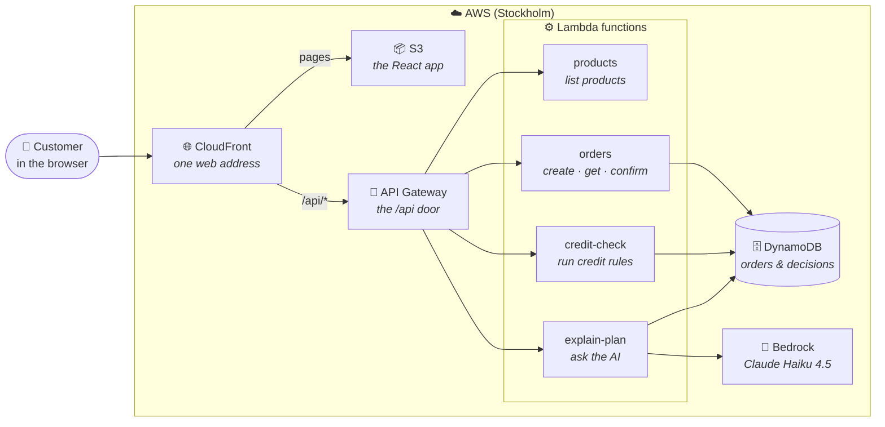
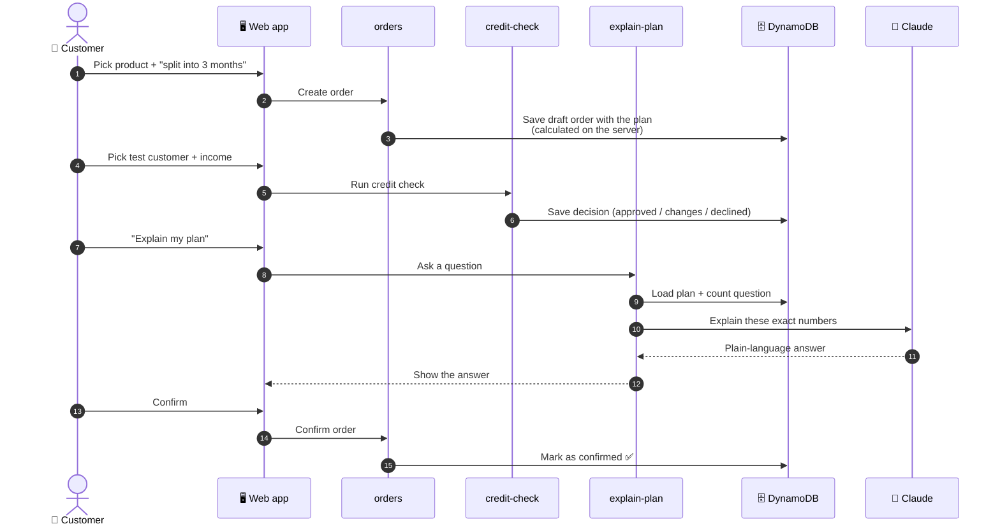
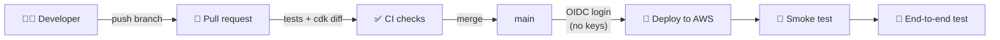

# PayInParts

A demo **pay-later checkout** with an **AI helper that explains the payment plan**.
Built on AWS serverless in TypeScript.

> ⚠️ Demo only. No real payments, no real personal data.

**Live demo:** https://d58y7vetykriz.cloudfront.net

## What it shows

- Full-stack TypeScript: React frontend, Lambda backend, CDK infrastructure — one shared `core` package.
- AWS serverless: CloudFront, S3, API Gateway, Lambda, DynamoDB, Bedrock.
- IAM done right: **no access keys anywhere**. `aws login` locally (short-lived console credentials), OIDC in CI, one least-privilege role per Lambda.
- Production basics: CI/CD, structured logs, X-Ray tracing (from Lambda), dashboard, alarms, smoke and e2e tests.
- AI with guardrails: Claude explains numbers; it never calculates them.

## How it works

### The customer journey

1. **Shop** — pick a product (headphones, bike, sofa…).
2. **Checkout** — choose *pay now*, *pay in 30 days*, or *split into 3, 6 or 12 months*.
   Each option shows the monthly cost **and** the total cost, computed in the browser with the same code the backend uses.
3. **Continue** — the backend saves a **draft order** with the plan it calculated itself (the browser's numbers are never trusted).
4. **Credit check** — pick a fake test customer (no personal number field exists) and a monthly income.
   The rules return **approved**, **approved with changes** (e.g. "a 6-month plan would work"), or **declined** (with a calm "pay now instead").
5. **Explain this plan** — Claude on Bedrock explains the plan in plain Swedish or English and answers follow-ups like "what if 6 months?".
6. **Confirm** — only allowed after an approved check (or for pay now). Confirming twice is safe.

### What happens on each request

| Step | Route | Lambda | Reads / writes |
|---|---|---|---|
| Shop | `GET /api/products` | products | — |
| Continue | `POST /api/orders` | orders | writes `ORDER#id / META` |
| Credit check | `POST /api/orders/{id}/credit-check` | credit-check | reads META, writes `DECISION` |
| Explain | `POST /api/orders/{id}/explain` | explain-plan | reads META, counts questions, calls Bedrock |
| Confirm | `POST /api/orders/{id}/confirm` | orders | reads META + DECISION, sets `confirmed` |
| Order page | `GET /api/orders/{id}` | orders | reads META + DECISION |

### The Lambda functions

A **Lambda function** is a small piece of backend code that AWS runs only when a request comes in. There are no servers to manage, and it costs nothing when idle.
All four run Node.js 22 on ARM, with 512 MB memory. They share `services/api/src/http.ts` for JSON parsing, the error shape and logging.

| Lambda | File | What it does | May access (IAM) |
|---|---|---|---|
| **products** | `handlers/products.ts` | Returns the list of demo products. | Nothing (logs only) |
| **orders** | `handlers/orders.ts` | Handles three routes. **Create:** checks the product, calculates the plan with `core`, saves a draft order. **Get:** loads the order and its credit decision. **Confirm:** only if pay now or approved; confirming twice returns the same order. | DynamoDB: PutItem, Query, UpdateItem |
| **credit-check** | `handlers/credit-check.ts` | Checks the test customer and income, runs the credit rules from `core`, and saves the decision with a rules version. Refuses confirmed and pay-now orders. Emits a `CreditDecision` metric. | DynamoDB: GetItem, PutItem |
| **explain-plan** | `handlers/explain-plan.ts` | Loads the saved plan, checks the per-order (20) and daily (500) limits, calculates the alternatives with `core`, and asks Claude on Bedrock to explain them. Returns a friendly error if Bedrock is down. Timeout 20 s (others 10 s). | DynamoDB: GetItem, UpdateItem · Bedrock: InvokeModel on Claude Haiku 4.5 only |

The browser only talks to **one domain** (CloudFront). `/api/*` goes to API Gateway; everything else is the React app from S3.

### The rules that matter

- **Money is integer öre.** Plans use the annuity formula; the **effective annual rate** includes all fees.
- **The AI never calculates.** The Lambda loads the saved plan, computes every alternative with `packages/core`, and puts those numbers in the prompt. Claude only explains and compares.
- **AI limits:** 20 questions per order, 500 per day for the whole app, 1 request/second on the route, 400 output tokens. If Bedrock fails, the plan still works.
- **Least privilege:** each Lambda has its own IAM role with only the actions it uses. Only `explain-plan` may call Bedrock, and only this one model. CDK tests check this.
- **No keys:** laptops use `aws login`, GitHub Actions use OIDC, Lambdas use roles. Bedrock needs no API key.

## Architecture

### The big picture



**In one sentence:** the browser talks to **one address** (CloudFront). Pages come from **S3**. Everything under `/api` goes to a small **Lambda function** for that job. The functions store data in **DynamoDB**, and only `explain-plan` may talk to the **AI**.

### One purchase, step by step



### How code reaches AWS



## Repo layout

| Folder | What |
|---|---|
| `packages/core` | Money, payment plans, credit rules, products, API contract (pure TS) |
| `services/api` | Lambda handlers |
| `apps/web` | React + Vite frontend |
| `infra` | AWS CDK app |
| `e2e` | Playwright tests against the live site |
| `docs/decisions` | Why things are the way they are |

## Run locally

The **frontend runs locally**; the **API runs in AWS**. Vite forwards `/api/*` to the deployed site, so you don't need AWS credentials to develop the UI.

```bash
pnpm install
pnpm test            # unit + API + CDK tests (no AWS needed)
VITE_API_PROXY=https://d58y7vetykriz.cloudfront.net pnpm --filter @payinparts/web dev
# open http://localhost:5173
```

The Lambdas are tested locally with mocked DynamoDB and Bedrock (`pnpm --filter @payinparts/api test`). There is no local Lambda emulator — deploy to see backend changes live.

## Log in to AWS (every new terminal)

You need this before any `aws` or `cdk` command. The login is short-lived (a few hours) — no access keys.

1. **Point this terminal at the project's AWS profile:**
   ```bash
   export AWS_PROFILE=payinparts
   ```
   Do this in **every new terminal window**. Otherwise the terminal may use another AWS account.
2. **Log in:**
   ```bash
   aws login --profile payinparts
   ```
   Your browser opens. Log in as the IAM user (not root), enter your MFA code, and click **Allow**.
   If it asks *"Configure AWS skills and the AWS MCP server…?"*, answer `n`.
3. **Check you are in the right account:**
   ```bash
   aws sts get-caller-identity
   ```
   The `Arn` should end with `:user/<your-user>` — not `root`.

**Troubleshooting**

| You see | Fix |
|---|---|
| `Invalid choice` for `aws login` | Your AWS CLI is too old. Run `aws --version` (need ≥ 2.32), then `brew upgrade awscli`, or use `/opt/homebrew/bin/aws login`. |
| `Your session has expired` | Run step 2 again. |
| `The config profile (payinparts) could not be found` | Run step 2 — it creates the profile. |
| `Profile '…' is already configured with Access Key credentials` | You forgot `--profile payinparts`; it tried another profile. |

## Deploy

Merging to `main` deploys via GitHub Actions (OIDC, no stored keys).
Manual deploy:

First [log in to AWS](#log-in-to-aws-every-new-terminal), then:

```bash
pnpm --filter @payinparts/web build
pnpm --filter @payinparts/infra exec cdk deploy PayInParts -c alertEmail=<email> -c githubRepo=maxaakre/payinparts
```

### First-time setup

Use `<owner>/<repo>` for your GitHub repo (this repo: `maxaakre/payinparts`).

1. Secure the root user with MFA.
2. Create a **$10 budget** with email alerts (skip while on the AWS free plan — you can't be charged).
3. Create an IAM user in group `admins` (AdministratorAccess) with **console access only — no access keys**, turn on MFA, then run `aws login --profile payinparts` (AWS CLI ≥ 2.32).
   IAM Identity Center is the enterprise alternative, but enabling it creates an AWS Organization, which ends the free plan.
4. Enable **Bedrock access to Claude Haiku 4.5** in `eu-north-1` (submit Anthropic's one-time use case form). New accounts may wait up to 2 hours for account verification.
5. `export AWS_PROFILE=payinparts` and run `pnpm --filter @payinparts/infra exec cdk bootstrap aws://<account>/eu-north-1`.
6. Deploy the GitHub OIDC stack: `pnpm --filter @payinparts/infra exec cdk deploy PayInPartsGithubOidc -c alertEmail=<email> -c githubRepo=<owner>/<repo>`.
   If your repo uses GitHub's **immutable OIDC subject claims** (`gh api repos/<owner>/<repo>/actions/oidc/customization/sub`), set `githubSubjectPrefix` in `infra/cdk.json` to the `sub_claim_prefix` it returns.
7. Set repo variables: `gh variable set AWS_ACCOUNT_ID --body <account>` and `gh variable set ALERT_EMAIL --body <email>`.
8. Confirm the SNS subscription email.

More detail: `docs/superpowers/plans/2026-09-30-delbetala.md`, Task 15.

## Observability notes

- **X-Ray:** the HTTP API has no X-Ray support. Traces start at the Lambda.
- **Alarms:** Lambda error alarms only catch timeouts, init failures and OOM, because `httpHandler` returns app errors as 500 responses. The **API 5xx alarm** is the main signal.
- **AI spend:** max 500 questions per UTC day, plus an alarm above 200 questions per hour.

## How it was built

Spec first, then a step-by-step plan, then small test-driven steps with an AI coding agent.
See `docs/superpowers/` and `CLAUDE.md`.
